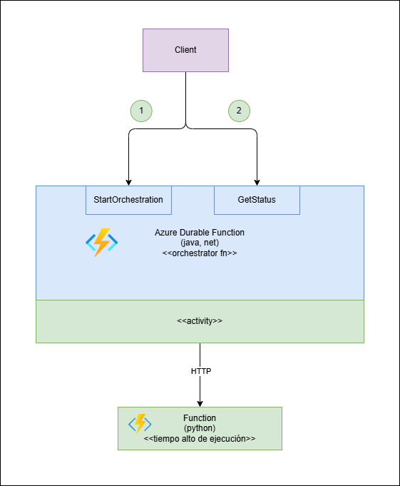

# HTTP Async API Samples - Azure Durable Function

En esta sección encontrarás un ejemplo de referencia de Azure Durable Function en Java y .Net implementando el patrón Http Async API

Para mayor información sobre el patrón revisar https://learn.microsoft.com/en-us/azure/azure-functions/durable/durable-functions-overview?tabs=in-process%2Cnodejs-v3%2Cv1-model&pivots=csharp#async-http

## Arquitectura del ejemplo

El ejemplo implementa un Azure Durable Function con el patrón Http Async API, que llama a un Azure Function que está en Python que simula demora en su ejecución.

El Azure Durable Function expone 2 endpoints:
1. StartOrchestration, que permite inicializar la ejecución
2. GetStatus, que permite saber el estado de la ejecución

## Ejemplo en diferentes frameworks

Este repo tiene ejemplos en diferentes lenguajes

| Patrón | Lenguaje | Sección |
|---|:---|---:|
| Http Async Api |  Java | <a href="java/README.md">Ejemplo con java</a> |
| Http Async Api |  Net  |  No implementado |